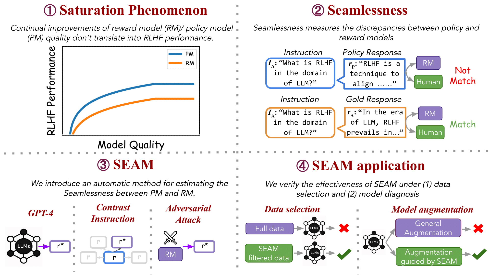

This is the code repository for [It Takes Two: On the Seamlessness between Reward and Policy Model in RLHF](https://arxiv.org/abs/2406.07971).

Reinforcement Learning from Human Feedback (RLHF) involves training policy models (PMs) and reward models (RMs) to align language models with human preferences. Instead of focusing solely on PMs and RMs independently, we propose to examine their interactions during fine-tuning, introducing the concept of seamlessness. Our study starts with observing the saturation phenomenon, where continual improvements in RM and PM do not translate into RLHF progress. Our analysis shows that RMs fail to assign proper scores to PM responses, resulting in a 35% mismatch rate with human preferences, highlighting a significant discrepancy between PM and RM. To measure seamlessness between PM and RM without human effort, we propose an automatic metric, SEAM. SEAM quantifies the discrepancies between PM and RM judgments induced by data samples. We validate the effectiveness of SEAM in data selection and model augmentation. Our experiments demonstrate that (1) using SEAM-filtered data for RL training improves RLHF performance by 4.5%, and (2) SEAM-guided model augmentation results in a 4% performance improvement over standard augmentation methods.



If you find this work helpful, please consider citing the following:
```
@misc{lu2024takestwoseamlessnessreward,
      title={It Takes Two: On the Seamlessness between Reward and Policy Model in RLHF}, 
      author={Taiming Lu and Lingfeng Shen and Xinyu Yang and Weiting Tan and Beidi Chen and Huaxiu Yao},
      year={2024},
      eprint={2406.07971},
      archivePrefix={arXiv},
      primaryClass={cs.CL},
      url={https://arxiv.org/abs/2406.07971}, 
}
```
